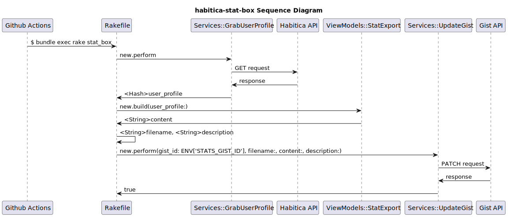

# habitica-stat-box

Show my Habitica [status in a pinned Gist](https://gist.github.com/umbrella-h/2affbec51aec6050a462cee0b2293e46) to build social motivation for developing good habits.
> <sup><sub>Inspired by [kylemocode/medium-stat-box](https://github.com/kylemocode/medium-stat-box). Powered by GitHub Actions, GrabzIt, and [habitica-avatar](https://github.com/crookedneighbor/habitica-avatar)<sub></sub> 

```
@khno3 🥷 Level 72 Rogue 
🩸 Health 50/50 💪 Exp 901/2160 💎 Mana 160/160
> Every pet 🦊, equipment 🗡, or level up 🔺
> represents my dedication to
> developing good habits 👏
```

I am now improving the feature which shows the latest [avatar in a Gist](https://gist.github.com/umbrella-h/8742be48f03de4f058a50d796d1419e9).


## What is Habitica?

[Habitica](https://github.com/HabitRPG/habitica) is an open sourced habit tracker app which treats your goals like a Role Playing Game.

If you are interested in the game mechanics, please check their fandom page, for example, [Damage to Player in Habitica](https://habitica.fandom.com/wiki/Damage_to_Player).

## Prerequisites

1. [Sign up for Habitica](https://habitica.com).
1. [Sign up for GrabzIt](https://grabz.it) if you want to show your avatar image as well. (Please check the limitation for free accounts.)
    >  The `Update Avatar Gist` action is unstable now. Please check [Reported Bugs](#reported-bugs).

1. Fork this repository.
1. Create new public GitHub Gists (https://gist.github.com/)
1. Create a token with the gist scope. (https://github.com/settings/tokens/new)
1. Take a look at `.env.template` and create your Repository Secrets of Actions ([Guides for creating encrypted secrets for a repository](https://docs.github.com/en/actions/security-guides/encrypted-secrets#creating-encrypted-secrets-for-a-repository)).

## Usage

1. Enable `Update Stats Gist` workflow in your repository.
    >  The `Update Avatar Gist` action is unstable now. Please check [Reported Bugs](#reported-bugs).

1. The cron job runs every 2 hours between 00:05 ~ 16:05 UTC. Manual `workflow_dispatch` trigger is also available.
1. [Pin your Gist in your Github profile page](https://docs.github.com/en/account-and-profile/setting-up-and-managing-your-github-profile/customizing-your-profile/pinning-items-to-your-profile).

## Reported Bugs

1. The `Update Avatar Gist` action is unstable now. Please check [umbrella-h/habitica-stat-box/issues #14](https://github.com/umbrella-h/habitica-stat-box/issues/14). Before the bug is fixed, it is recommanded to disable it. if you still want to update the image in you gist, please trigger it manually, and check the result to see if a retry is needed.
1. GitHub will suspend the scheduled trigger for GitHub action workflows if there is no commit in the repository for the past 60 days. I am trying to use [gautamkrishnar/keepalive-workflow](https://github.com/gautamkrishnar/keepalive-workflow). Please check [umbrella-h/habitica-stat-box/issues #18](https://github.com/umbrella-h/habitica-stat-box/issues/18).

## Development

Edit `.env` file, and run the command bellow for testing in development environment .

```
$ bundle exec rake dev_stats
```

```
$ bundle exec rake dev_avatar
```

Sequence Diagram

